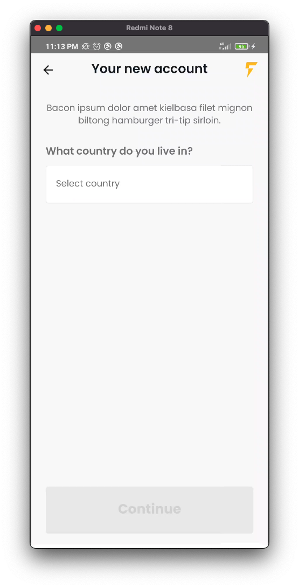
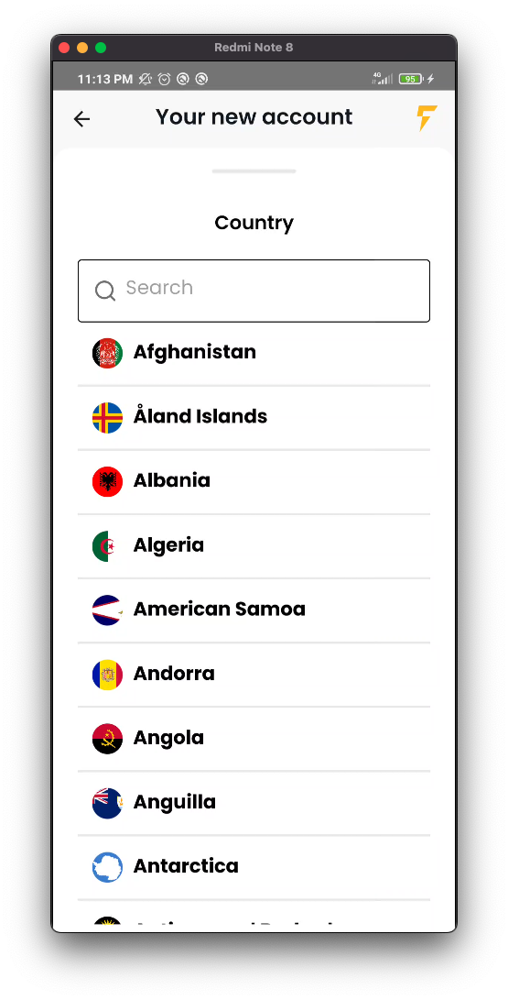
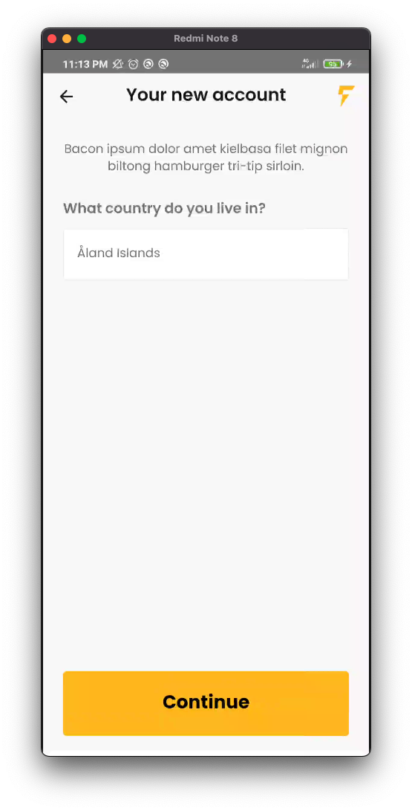
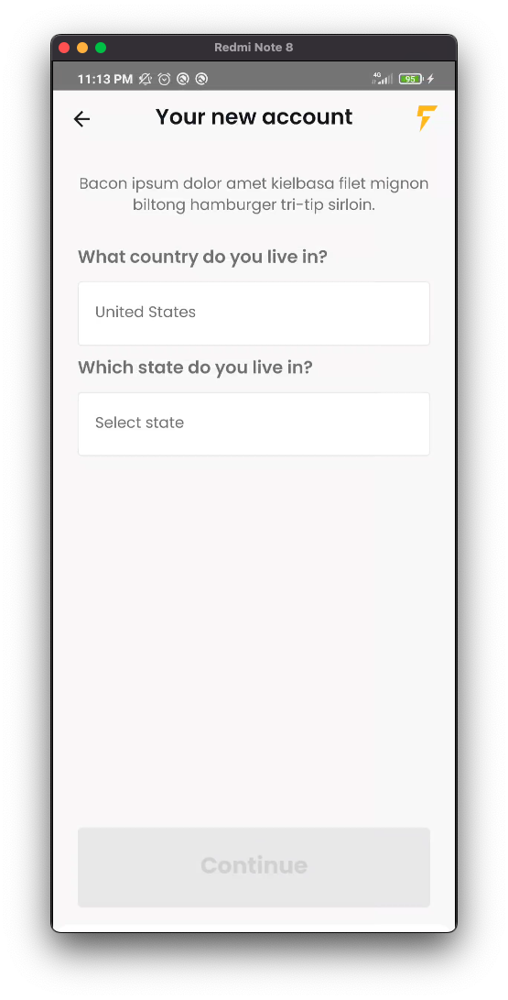
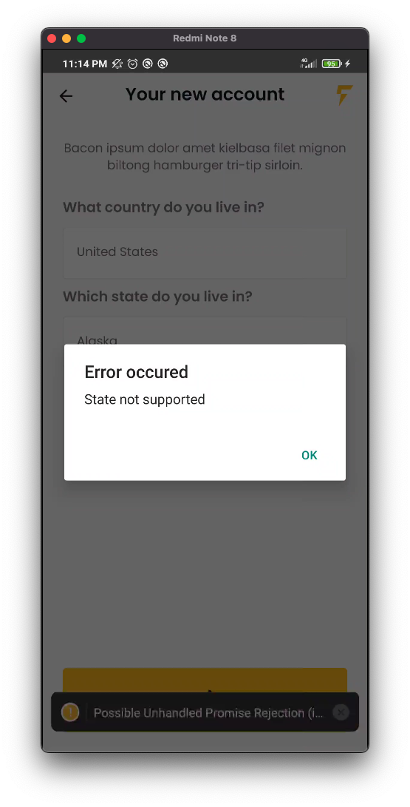
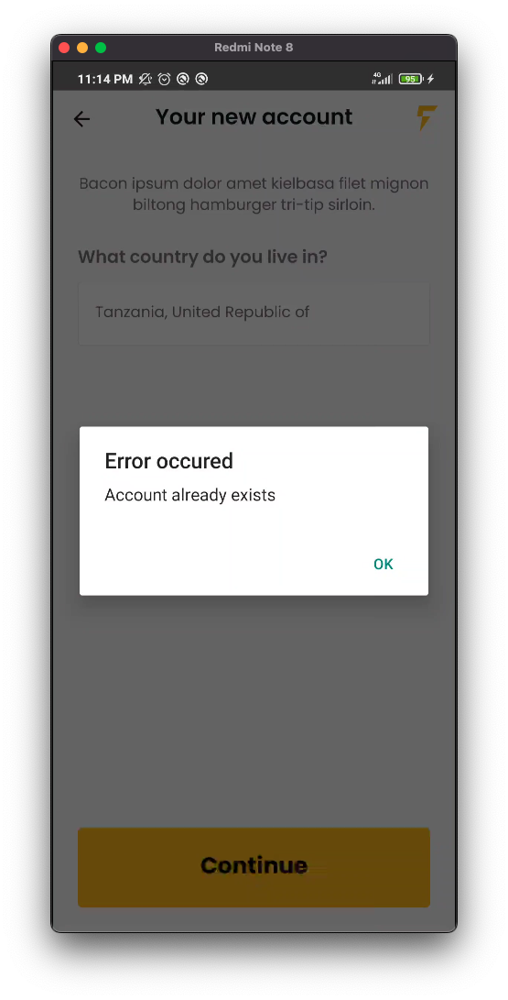
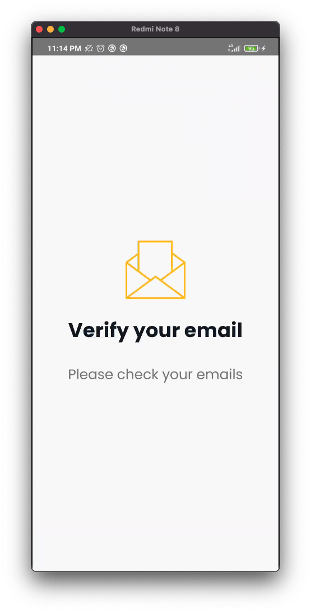
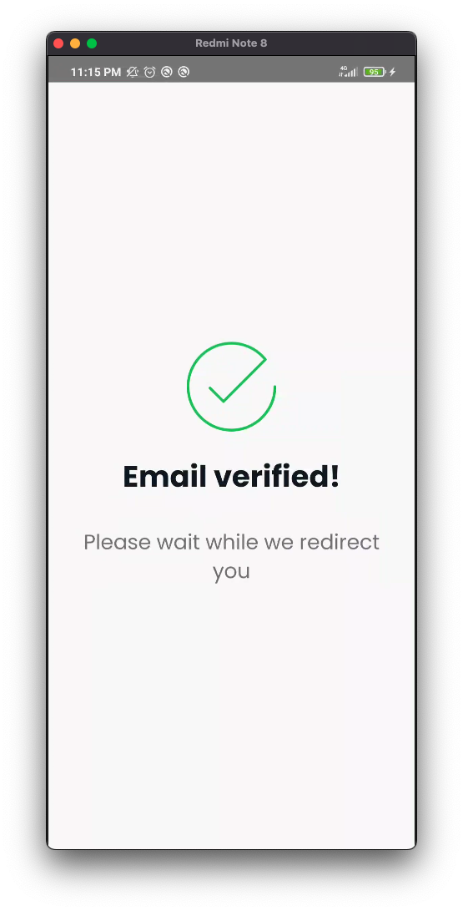
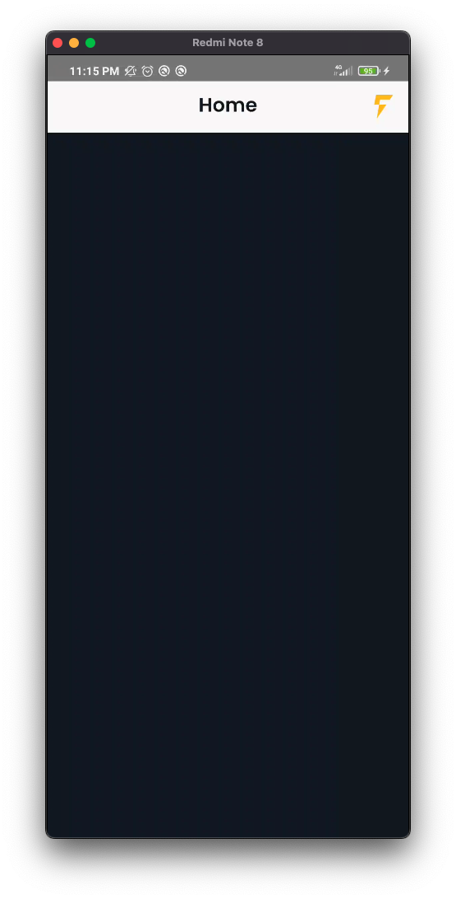

# BitcoinsFast

__Hibrid mobile application made with react native__

## showcase video

https://user-images.githubusercontent.com/38187170/173268468-349334af-70c2-4ebb-bdd1-037ff3bd8df5.mp4


## Features

1. Multiple screen navigation with react-navigation
2. Internationalization with react-i18next
3. Themed components with styled-components
4. State management with redux-toolkit
5. HTTP requests with axios
6. SVG images with react-native-svg
7. Typechecking with typescript

## Future improvements

- add security layer with fingerprint (or face) scanner to access the app upon lunch (such as Nubank)
- test different screen sizes and os versions


## Setup

To run the application in your local environment, follow the steps:

1. Clone the repository with

    `git clone https://github.com/fernandobelotto/BitcoinsFast.git`

2. Install the project dependencies with (make sure to have node installed)

    `npm install`

3. Connect your device to your computer and then install the app with:

    `npm run android` or `npm run ios`


4. Run the development server with

    `npm run start`


## Useful commands

```
yarn react-native generate-bootsplash src/assets/images/logomark.png \
  --background-color=101820 \
  --logo-width=100 \
  --assets-path=assets \
```


## App Screenshots











